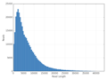

[(Nucleomics-VIB)](https://github.com/Nucleomics-VIB)
 - PacBio-Tools
==========

*All tools presented below have only been tested by me and may contain bugs, please let me know if you find some. Each tool relies on dependencies normally listed at the top of the code (cpan for perl and cran for R will help you add them)*

Please refer to the accompanying **[wiki](https://github.com/Nucleomics-VIB/pacbio-tools/wiki)** for examples and workflows.

### Table of Contents

**[[smrtlink-tools](#smrtlink-tools)]**

- **[bam_subset_smrt.sh](#bam_subset_smrtsh)** - **[explain-LocalContextFlags.html](#explain-localcontextflagshtml)** - **[rundata2tgz.sh](#rundata2tgzsh)** - **[smrtlink_init.sh](#smrtlink_initsh)** - **[pbvcf2vcf4.pl](#pbvcf2vcf4pl)** -

**[[bam-utils](#bam-utils)]**

- **[bam2sizedist.sh](#bam2sizedistsh)** - **[bam_size-filter.pl](#bam_size-filterpl)** - 

**[[general-tools](#general-tools)]**

- **[pb_STARlong.sh](#pb_starlongsh)** - 


## smrtlink-tools
*[[back-to-top](#top)]*  

### **bam_subset_smrt.sh**
*[[smrtlink-tools](#smrtlink-tools)]*

The bash file **[bam_subset_smrt.sh](/smrtlink-tools/bam_subset_smrt.sh)** creates a  random subset from a BAM data and uploads the resulting file to the SMRT server as a new dataset.
```bash
# Usage: bam_subset_smrt.sh -b <input.bam>
# script version 1.0, 2017_01_18
# [optional: -o <output_prefix|sample_SS_XXpc>]
# [optional: -s <seed|1>]
# [optional: -f <fraction in %|10>]
# [optional: -t <threads|32>]
# [optional: -S <SMRT-server|"${smrthostname}">]
# [optional: -p <SMRT-port|9091>]
# [-h for this help]
```

### **explain-LocalContextFlags.html**
*[[smrtlink-tools](#smrtlink-tools)]*

The html file **[explain-LocalContextFlags.html](/smrtlink-tools/bam_subset_smrt.sh)** explains explain **LocalContext Flags** present in PacBio BAM data as a binary value in plain english. The content of this page is fully taken and adapted from a similar page dedicated to explaining SAM flags and hosted **<a href="http://picard.sourceforge.net/explain-flags.html">here</a>**. Please cite the PICARD source and not our version when using this code.
```bash
Open a local copy of the file using your favorite web browser to use it
```

### **rundata2tgz.sh**
*[[smrtlink-tools](#smrtlink-tools)]*

The bash file **[rundata2tgz.sh](/smrtlink-tools/rundata2tgz.sh)** creates a tar-gz archive from a local folder generated after aSequel run on the storage share. It ignores accessory files preseznt after a manual transfer.
```bash
# Usage: rundata2tgz.sh
# script version 1.0, 2017_01_23
## input files
# [required: -i <run-folder> (containing the flow-cell folder)]
# [-f <flowcell name (default <1_A01> for a single-cell run)>]
# [-o <output folder (default to <$SMRT_DOWNLOADS>]
# [-h for this help]
```
### **smrtlink_init.sh**
*[[smrtlink-tools](#smrtlink-tools)]*

The bash file **[smrtlink_init.sh](/smrtlink-tools/smrtlink_init.sh)** creates a launcher for the SMRT Link service (not tested).
```bash
# please use at your own risks
# info on how to set this can be found on the web
```

### **pbvcf2vcf4.pl**
*[[smrtlink-tools](#smrtlink-tools)]*

The bash file **[pbvcf2vcf4.pl](/smrtlink-tools/pbvcf2vcf4.pl)** creates a VCF version 4.x copy of ta SMRT vcf 3.3 file. The original format does not comply to VCF standards and the original GFF output does not help. The code requires the reference assembly file adn its faidx index to add contig lines to the output and extract sequence at INS positions. The current code does only support haploid calls.

```bash
# !!! this code is currently only valid for haploid calls
usage: pbvcf2vcf4.pl <pacbio_vcf3.3.vcf> <indexed-fasta-reference>
```

## bam-utils
*[[back-to-top](#top)]*  

### **bam_size-filter.pl**
*[[bam-utils](#bam-utils)]*

The perl script **[bam_size-filter.pl](bam-utils/bam_size-filter.pl)** filters BAM records exports and saves length information (and optionally BAM data) to file(s).
```bash
Aim: Filter a BAM file by read length
#  print filtered read lengths to file
#  (also output kept reads to BAM if -b is set)
## Usage: bam_size-filter.pl <-i bam-file>
# optional <-m minsize>
# optional <-x maxsize>
# optional <-b to also create a BAM output (default only text file of lengths)>
# <-h to display this help>
```

### **bam2sizedist.sh**
*[[bam-utils](#bam-utils)]*

The bash file **[bam2sizedist.sh](/bam-utils/bam2sizedist.sh)** extracts from a BAM file: molecule ID, read length, barcode information, and polymerase coordinates, and saves results to a text table (TSV) for stats in R.
```bash
# provide a bam file to be parsed!
```

### **bam_size-filter.sh**# 
*[[bam-utils](#bam-utils)]*

The perl file **[bam_size-filter.pl](/bam-utils/bam_size-filter.pl)** filters BAM records by min and max length. It output all filtered lengths to file for stats and can also create a BAM output (optional).
```bash
Aim: Filter a BAM file by read length
#  print filtered read lengths to# please provide mandatory arguments -q and -d!
# Usage: pb_STARlong.sh 
# -q <query sequences (reads)> 
# -d <STAR_database-folder>
# optional -t <threads> (default 8)>
# script version 1.0, 2017_03_03
# [-h for this help] file
#  (also output kept reads to BAM if -b is set)
## Usage: bam_size-filter.pl <-i bam-file>
# optional <-m minsize>
# optional <-x maxsize>
# optional <-b to also create a BAM output (default only text file of lengths)>
# <-h to display this help>
```

## general-tools
*[[back-to-top](#top)]*  

### **pb_STARlong.sh**
*[[general-tools](#general-tools)]*

The facilitating bash script **[pb_STARlong.sh](general-tools/pb_STARlong.sh)** runs a preconfigured STARlong command with PacBio reads (Fasta). The arguments used in this script were reproduced from the dedicated Github page https://github.com/PacificBiosciences/cDNA_primer/wiki/Bioinfx-study:-Optimizing-STAR-aligner-for-Iso-Seq-data and can be amended when changes are necessary.

```bash
# Usage: pb_STARlong.sh 
# -q <query sequences (reads)> 
# -d <STAR_database-folder>
# optional -t <threads> (default 8)>
# script version 1.0, 2017_03_03
# [-h for this help]
```

*[[back-to-top](#top)]*  

<hr>

<h4>Please send comments and feedback to <a href="mailto:nucleomics.bioinformatics@vib.be">nucleomics.bioinformatics@vib.be</a></h4>

<hr>


This work is licensed under a [Creative Commons Attribution-ShareAlike 3.0 Unported License](http://creativecommons.org/licenses/by-sa/3.0/).
