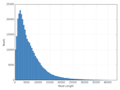

[(Nucleomics-VIB)](https://github.com/Nucleomics-VIB)
 - PacBio-Tools
==========

*All tools presented below have only been tested by me and may contain bugs, please let me know if you find some. Each tool relies on dependencies normally listed at the top of the code (cpan for perl and cran for R will help you add them)*

Please refer to the accompanying **[wiki](https://github.com/Nucleomics-VIB/pacbio-tools/wiki)** for examples and workflows.

### Table of Contents

**[[smrtlink-tools](#smrtlink-tools)]**

- **[bam_subset_smrt.sh](#bam_subset_smrtsh)** - **[explain-LocalContextFlags.html](#explain-localcontextflagshtml)** - **[rundata2tgz.sh](#rundata2tgzsh)** - **[jobdata2tgz.sh](#jobdata2tgzsh)** - **[smrtlink_init.sh](#smrtlink_initsh)** - **[pbvcf2vcf4.pl](#pbvcf2vcf4pl)** -

**[[bam-utils](#bam-utils)]**

- **[pb2polymerase.sh](#pb2polymerasesh)** - **[SEQUELstats4one.sh](#sequelstats4onesh)** - **[sequel_read_lengths.R](#sequel_read_lengthsr)**  - **[bam_size-filter.pl](#bam_size-filterpl)** - **[bam2sizedist.sh](#bam2sizedistsh)** -

**[[qc-tools](#qc-tools)]**

- **[countfasta.py](#countfastapy)** -

**[[general-tools](#general-tools)]**

- **[arrow_polish_asm.sh](#arrow_polish_asmsh)** - **[pb_STARlong.sh](#pb_starlongsh)** - 


## smrtlink-tools
*[[back-to-top](#top)]*  

### **bam_subset_smrt.sh**
*[[smrtlink-tools](#smrtlink-tools)]*

The bash file **[bam_subset_smrt.sh](/smrtlink-tools/bam_subset_smrt.sh)** creates a  random subset from a BAM data and uploads the resulting file to the SMRT server as a new dataset.
```bash
# Usage: bam_subset_smrt.sh -b <input.bam>
# script version 1.0, 2017_01_18
# [optional: -o <output_prefix|sample_SS_XXpc>]
# [optional: -s <seed|1>]
# [optional: -f <fraction in %|10>]
# [optional: -t <threads|32>]
# [optional: -S <SMRT-server|"${smrthostname}">]
# [optional: -p <SMRT-port|9091>]
# [-h for this help]
```

### **explain-LocalContextFlags.html**
*[[smrtlink-tools](#smrtlink-tools)]*

The html file **[explain-LocalContextFlags.html](/smrtlink-tools/bam_subset_smrt.sh)** explains explain **LocalContext Flags** present in PacBio BAM data as a binary value in plain english. The content of this page is fully taken and adapted from a similar page dedicated to explaining SAM flags and hosted **<a href="http://picard.sourceforge.net/explain-flags.html">here</a>**. Please cite the PICARD source and not our version when using this code.
```bash
Open a local copy of the file using your favorite web browser to use it
```

### **rundata2tgz.sh**
*[[smrtlink-tools](#smrtlink-tools)]*

The bash file **[rundata2tgz.sh](/smrtlink-tools/rundata2tgz.sh)** creates a tar-gz archive from a local folder generated after a Sequel run on the storage share. The script creates a md5sum file and verifies that the checksum is valid. This script should be ran for each subfolder present in a run folder (eg: 1_A01, 2_B01, ...).
```bash
# Usage: rundata2tgz.sh
# script version 1.1.1, 2017_09_20
## input files
# [required: -i <run-folder> (name of the run folder containing the flow-cell folder)]
# [-f <flowcell name (default <1_A01> for a single-cell run)>]
# [-o <output folder (default to <$GCDADA>]
# [-l <show the list of runs currently present on the server>]
# [-h for this help]
```

### **jobdata2tgz.sh**
*[[smrtlink-tools](#smrtlink-tools)]*

The bash file **[jobdata2tgz.sh](/smrtlink-tools/jobdata2tgz.sh)** creates a tar-gz archive from a job folder generated after a SMRTLink run on the storage share. The script creates a md5sum file and verifies that the checksum is valid (rem: .las files are excluded from the archive)
```bash
# Usage: jobdata2tgz.sh
# script version 1.0, 2018_04_13
## input files
# [required: -i <job-folder> (name of the run folder containing the SMRTLink job)]
# [-o <output folder ($NCDATA|$GCDATA; default to <$GCDADA>)]
# [-S <JOB data root (default to <$SMRT_DATA/000>)]
# [-l <show the list of jobs currently present on the server>]
# [-h for this help]
```

### **smrtlink_init.sh**
*[[smrtlink-tools](#smrtlink-tools)]*

The bash file **[smrtlink_init.sh](/smrtlink-tools/smrtlink_init.sh)** creates a launcher for the SMRT Link service (not tested).
```bash
# please use at your own risks
# info on how to set this can be found on the web
```

### **pbvcf2vcf4.pl**
*[[smrtlink-tools](#smrtlink-tools)]*

The bash file **[pbvcf2vcf4.pl](/smrtlink-tools/pbvcf2vcf4.pl)** creates a VCF version 4.x copy of the SMRT vcf 3.3 file. The original format does not comply to VCF standards and the original GFF output does not help. The code requires the reference assembly file and its faidx index to add contig lines to the output and extract sequence at INS positions. The current code does only support haploid calls. This code is experimental and not finished.
```bash
# !!! this code is currently only valid for haploid calls
usage: pbvcf2vcf4.pl <pacbio_vcf3.3.vcf> <indexed-fasta-reference>
```

## bam-utils
*[[back-to-top](#top)]*  

### **pb2polymerase.sh**
*[[bam-utils](#bam-utils)]*

The shell wrapper **[pb2polymerase.sh](bam-utils/pb2polymerase.sh)** recreates polymerase reads from scraps and subreads using Pacbio **bam2bam**. Also reports polymerase lengths to be used in R for plotting.
```bash
Usage: pb2polymerase.sh <name>.scraps.bam> <threads|8>
```

### **SEQUELstats4one.sh**
*[[bam-utils](#bam-utils)]*

The shell wrapper **[SEQUELstats4one.sh](bam-utils/SEQUELstats4one.sh)** applies code fro mthe Welcome Sanger repo to a single smartcell dataset (thereby avoiding issues where bsub is not installed; read: https://github.com/VertebrateResequencing/SEQUELstats/issues/1)
```bash
Usage: SEQUELstats4one.sh <path to the Sequel BAM data>
```

### **sequel_read_lengths.R**
*[[bam-utils](#bam-utils)]*

The R script **[sequel_read_lengths.R](bam-utils/sequel_read_lengths.R)** reports subread and scrap read length distribution from a Sequel smartcell folder. It also plots polymerase lengths when they have been pre-processed using pb2polymerase.sh
```bash
Usage: sequel_read_lengths.R <path to the Sequel run data>
```

## **bam_size-filter.pl**
*[[bam-utils](#bam-utils)]*

The perl script **[bam_size-filter.pl](bam-utils/bam_size-filter.pl)** filters BAM records exports and saves length information (and optionally BAM data) to file(s).
```bash
Aim: Filter a BAM file by read length
#  print filtered read lengths to file
#  (also output kept reads to BAM if -b is set)
## Usage: bam_size-filter.pl <-i bam-file>
# optional <-m minsize>
# optional <-x maxsize>
# optional <-b to also create a BAM output (default only text file of lengths)>
# <-h to display this help>
```

### **bam2sizedist.sh**
*[[bam-utils](#bam-utils)]*

The bash file **[bam2sizedist.sh](/bam-utils/bam2sizedist.sh)** extracts from a BAM file: molecule ID, read length, barcode information, and polymerase coordinates, and saves results to a text table (TSV) for stats in R.
```bash
# provide a bam file to be parsed!
```

### **bam_size-filter.sh**
*[[bam-utils](#bam-utils)]*

The perl file **[bam_size-filter.pl](/bam-utils/bam_size-filter.pl)** filters BAM records by min and max length. It output all filtered lengths to file for stats and can also create a BAM output (optional).
```bash
Aim: Filter a BAM file by read length
#  print filtered read lengths to# please provide mandatory arguments -q and -d!
# Usage: pb_STARlong.sh 
# -q <query sequences (reads)> 
# -d <STAR_database-folder>
# optional -t <threads> (default 8)>
# script version 1.0, 2017_03_03
# [-h for this help] file
#  (also output kept reads to BAM if -b is set)
## Usage: bam_size-filter.pl <-i bam-file>
# optional <-m minsize>
# optional <-x maxsize>
# optional <-b to also create a BAM output (default only text file of lengths)>
# <-h to display this help>
```

## qc-tools
*[[back-to-top](#top)]*  

### **countfasta.py**
*[[qc-tools](#qc-tools)]*

The python file **[countfasta.py](/qc-tools/countfasta.py)** reports the length distribution
and summary statistics of one or more FASTA files: a length histogram, total residues,
sequence count, N25/N50/N75 with the number of sequences at or above each threshold, GC
content, and N / ambiguous-base tallies. Input may be plain or gzipped, or read from stdin,
and statistics are aggregated across all files. Only the python3 standard library is
required.

This is an **independent VIB Nucleomics Core implementation**. It replaces the third-party
`countFasta.pl` (UC Davis Genome Center) that was removed from this repository on
2026-08-28 for lack of any licence grant; that script was not consulted while writing this
one. See [`NOTICE.md`](NOTICE.md). Output is *not* byte-compatible with the original — see
the Notes below.

```bash
# Usage: countfasta.py [-h] [-i BIN] [--sparse] [--json] [--n50-only] [--version] FASTA [FASTA ...]
# script version 1.0.0, 2026_08_28
## input files
# [required: FASTA ... one or more FASTA files (plain or gzipped), or '-' for stdin]
# [-i <bin size in residues> (default 100; a non-integer or non-positive value warns and falls back)]
# [--sparse omit empty histogram bins (useful for assemblies with few long contigs)]
# [--json emit the report as JSON instead of plain text]
# [--n50-only print only the N50 length in bp, for use in pipelines]
# [-h for this help]
```

Examples:
```bash
# plain report, default 100-residue bins
countfasta.py assembly.fasta

# aggregate several gzipped files, 1kb bins, skip empty bins
countfasta.py -i 1000 --sparse contigs_*.fasta.gz

# N50 straight into a variable
n50=$(countfasta.py --n50-only assembly.fasta)

# machine-readable, for a pipeline report
countfasta.py --json assembly.fasta > asm_stats.json
```

**Notes on differences from the removed UC Davis script.** Reported quantities are a
superset of the original's, but the output is deliberately not byte-identical, and several
original behaviours were bugs that are not reproduced:

| Behaviour | removed `countFasta.pl` | `countfasta.py` |
|---|---|---|
| Histogram bin labels | 0-based (`0:99`, `100:199`) | 1-based (`1:100`, `101:200`) |
| FASTA records sharing an identical header | merged into one sequence of summed length | counted separately |
| CRLF (Windows) FASTA | every sequence line dropped, reports all zeros | read correctly |
| Empty / unusable input | fatal division-by-zero part-way through the report | reports zeros, N-stats as `n/a` |
| N25/50/75 sequence count on tied lengths | rank of the threshold sequence | all sequences at or above the threshold |
| Header with no sequence (`>a` followed by another header, or a header-only file) | excluded from the sequence count | counted as a zero-length record |
| Residues before the first `>` header | silently ignored, exit status 0 | reported as an error, exit status 1 |
| gzip / stdin / `--json` / `-h` | not supported | supported |

If you have a parser reading the old output, the two changes that will affect it are the
**bin label base** and **duplicate-header merging**.


## general-tools
*[[back-to-top](#top)]*  

### **arrow_polish_asm.sh**
*[[general-tools](#general-tools)]*

The facilitating bash script **[arrow_polish_asm.sh](general-tools/arrow_polish_asm.sh)** maps Sequel reads to a draft Fasta assembly and uses the mapped reads to correct basecall errors and produce a polished version of the assembly.
```bash
# Usage: arrow_polish_asm.sh -a <fasta assembly> -b <sequel reads (bam)> 
# [optional: -p <smrt_bin path> (suggested: /opt/pacbio/smrtlink/smrtcmds/bin)
# [optional: -o <result folder>]
# [optional: -t <available threads|1>]
# [optional: -h <this help text>]
# script version 1.0, 2017_12_13
```

### **pb_STARlong.sh**
*[[general-tools](#general-tools)]*

The facilitating bash script **[pb_STARlong.sh](general-tools/pb_STARlong.sh)** runs a preconfigured STARlong command with PacBio reads (Fasta). The arguments used in this script were reproduced from the dedicated Github page https://github.com/PacificBiosciences/cDNA_primer/wiki/Bioinfx-study:-Optimizing-STAR-aligner-for-Iso-Seq-data and can be amended when changes are necessary.
```bash
# Usage: pb_STARlong.sh 
# -q <query sequences (reads)> 
# -d <STAR_database-folder>
# optional -t <threads> (default 8)>
# script version 1.0, 2017_03_03
# [-h for this help]
```

*[[back-to-top](#top)]*  

<hr>

<h4>Please send comments and feedback to <a href="mailto:nucleomics.bioinformatics@vib.be">nucleomics.bioinformatics@vib.be</a></h4>

<hr>


**Mixed content — no licence asserted.** This repository contains material from more than
one copyright holder. VIB Nucleomics Core claims no ownership of the third-party files and
asserts no licence over the repository as a whole. See [`NOTICE.md`](NOTICE.md) for exactly
which paths belong to whom, and contact us before reusing anything.
